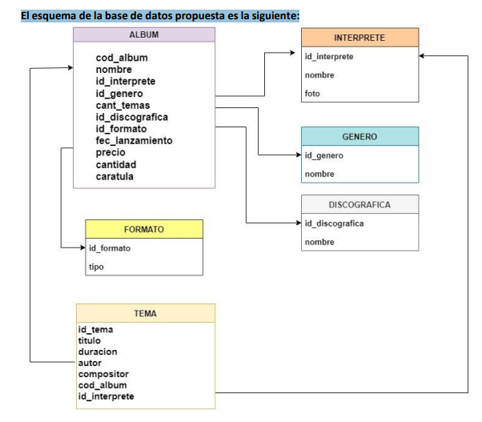

# Proyecto Integrador ISPC
## INTEGRANTES del Proyecto: 
- Sotelo Joaquín
- Mateo Coria
- Christian Coria

                                                 Proyecto Integrador ISPC

### TRABAJO INTEGRADOR – Programación Inicial y Bases de Datos

Una conocida casa de música de la ciudad de Formosa capital solicitó a nuestra empresa de
software que le confeccionemos un nuevo sistema que gestione sus Discos, Cassettes y
Compact Discs, que vende a los coleccionistas y turistas que asisten a su local, en el centro
de la ciudad.
El sistema debe proveer los siguientes requerimientos por parte del cliente:
- Alta, baja y modificación de datos de un álbum musical.
- Listado de álbumes disponibles por artista, en orden alfabético.
- Listado por género musical.
- Búsqueda por nombre de un álbum.



# Tecnologia Utilizada Django (Python)
## Base de datos Utilizada MySQL (aunque es posible usar mysqlite3 por defecto o otras bases de datos como Polgrest SQL con la conf.      correspondiente)

[==> Casos de Prueba <==](###) <- a completar!

Cosas que puedes hacer::

[==> Video de Funcionalidades <==](###) <- a completar!


- Podras ver como se desarrolla un C.R.U.D en Django 'Usando Class Base Views'.


# Instalar

Para instalar este software necesitas:

## Comprobar la versión de Python
Este proyecto se escribió con Python 3.10.5, por lo que le sugiero que pruebe con esta versión o superior para no tener problemas de compatibilidad.

Cómo verifico mi versión de python,

en sistemas *nix: 

```bash
> python --version
> Python 3.10.5
```

en windows:

```bash
c:\> py --version
c:\> Python 3.10.5
## Clonar el Repositorio

```bash
> git clone url_clonada . 
Luego de pegar la url clonada es importante colocar luego de un espacio, un Punto.
Esto con la finalidad de que no se cree una carpeta de mas, sino que se copie El Proyecto dentro de la raiz de la carpeta seleccionada para ese fin.

```
## Crea tu Ambiente Virtual
---bash
python -m venv env

Segido de su activacion:
source env/scripts/activate

## Instalar dependencias
Para instalar las dependencias, debe ejecutar `pip install`, asegúrese de estar en la carpeta del proyecto y pueda ver el 'requirements.txt' archivo cuando haga 'ls' o 'dir':

```bash
> pip install -r requirements.txt
```
Este último instalara los requerimientos necesarios en la terminal..

`algunos sistemas operativos requieren el uso de  pip3 o pip `

## Configuración de la aplicación Django

Una vez que termine la instalación de las dependencias, debe ejecutar algunos comandos Django.

### Migraciones

Initialize the database
:
```bash
> python mananage.py migrate

py manage.py collectstatic

windows:
```bash
c:\> py mananage.py migrate
```

### Ejecutar el servidor de prueba

```bash
> python mananage.py runserver
```
windows:
```bash
c:\> py mananage.py runserver
```
Go to localhost:8000/

para tener acceso a la aplicación.

'Aclaracion: es necesario contar con internet par la carga de imagenes de templates.

Si todo va bien, debería poder abrir el navegador y ver cómo se ejecuta la aplicación.

